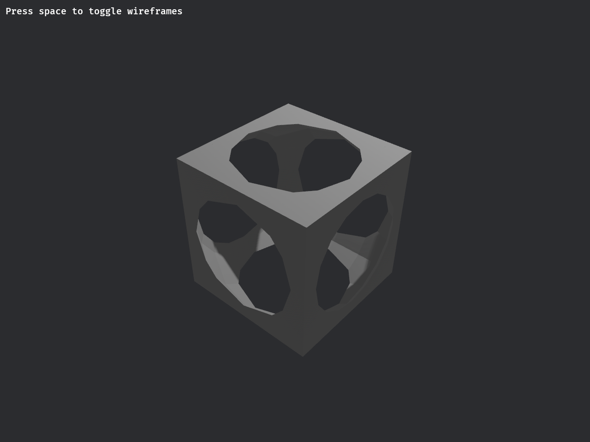

# csgrs-bevy-example

This small app allows you to view a csgrs CSG, rotate it, and toggle triangle wireframe visibility.  It is meant as an aid to programmatic CAD development and as an example of integrating csgrs with Bevy.
